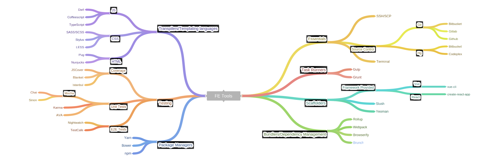

note: this is a sketch I made for a talk I gave to UIUC Webmonkeys on behalf of
Granular. The opinions expressed here are my own (unless otherwise credited),
or parroted from some medium blog that made me feel bad about something.


# Building your own Tool Chain
#### Alternately: WTF is webpack and how does it compare to SASS?


The problem: There are a *ton* of frontend development tools, and it's not always clear
why might want to use one over the other. Other times it's not clear why you
would need a certain tool at all.

## Learning Goals

Today you will learn:
* A brief gamut of some of the most common tools in a frontend developers toolchain:
    * Package Managers
    * Task Runners
    * Bundlers/Dependency Managers
    * Scaffolders
    * Transpilers
    * Test tools

* What purpose these tools serve, and why you *might* want to use them.
* How to set up your own toolchain

---
Each section has the goal of answering these three questions:

Why would I want this type of tool?
What are the available options?
How do they compare?

Please feel free to ask me questions whenever - especially if my explanation
doesn't clearly answer one of these questions for you.

## First Things First

Just because a tool or framework is popularly used (or just getting a lot of
attention on Twitter) doesn't mean you need to use it. 

Most JavaScript fatigue is self inflicted. Don't fall into that trap.

## A look at the landscape

[](./static/images/FE_Tools.svg)
(Click to view SVG)


## Task Runners

The goal of task runners is to automate everything that can be automated:
 * Transpiling
 * Minifying
 * Image Optimization
 * Package Bundling

### Grunt & Gulp

Configuration vs Code 

#### Grunt
```javascript
grunt.initConfig({
  clean: {
    src: ['build/app.js', 'build/vendor.js']
  },
  
  copy: {
    files: [{
      src: 'build/app.js',
      dest: 'build/dist/app.js'
    }]
  }
  
  concat: {
    'build/app.js': ['build/vendors.js', 'build/app.js']
  }
  
  // ... other task configurations ...
  
});

grunt.registerTask('build', ['clean', 'bower', 'browserify', 'concat', 'copy']);
```

#### Gulp 

```javascript
var gulp = require('gulp');
var sass = require('gulp-sass');
var minifyCss = require('gulp-minify-css');
var rename = require('gulp-rename');

//declare the task
gulp.task('sass', function(done) {
  gulp.src('./scss/ionic.app.scss')
    .pipe(sass())
    .pipe(gulp.dest('./www/css/'))
    .pipe(minifyCss({
      keepSpecialComments: 0
    }))
    .pipe(rename({ extname: '.min.css' }))
    .pipe(gulp.dest('./www/css/'))
    .on('end', done);
});
```

Gulp users will be quick to point out that Gulp uses streams which results in
noticeably faster performance.

Remember: it's a personal preference. (i.e. anyone who disagrees with you is objectively wrong)

### NPM Scripts

You can also configure your `package.json` to run tasks:


```javascript
{
  "name": "isomorphic-polyfill-streamer",
  "version": "0.0.1",
  "main": "index.js",
  "scripts": {
    "dev": "node build/dev-server.js",
    "build": "node build/build.js",
    "unit": "karma start test/unit/karma.conf.js --single-run",
  },
  "dependencies": {
    ...
  },
  "repository": {},
  "license": "MIT"
}
```

## Scaffolders

Scaffolders minimize the amount of boilerplate you have to manually write.

> Scaffolding, in the Yeoman sense of the word, means generating files for your
> web app based on your specific configuration requests.  

* Yeoman 
    * Bower/npm + Grunt/Gulp + Yo
    * Uses generators to scaffold projects and install dependencies
* Slush 
    * "Gulp as a replacement for Yeoman"
    * Like Yeoman, uses generators

It's worth noting that Yeoman has been around considerably longer than Slush.
This means you are a lot more likely to find what you want within Yeoman's
ecosystem.

The experience of writing and tweaking a Slush generator is (IMO) much nicer
(again, code vs config)

## Package Managers

If you're not familiar, a package manager is a tool that allows you to install,
update, configure, and remove software, libraries, utilities and their dependencies.

npm is the official package manager for Node, with a package registry hosted at
[npmjs.org](https://npmjs.org)

There are _several_ package mangers that can serve as drop in replacements for npm:
* yarn ('Fast, reliable and secure dependency management')
* ied ('Like npm, but faster')
* pnpm ('Fast, disk space efficient npm install')

They tend to focus on better performance and determinism (that is, given a
certain input, always provide the same output)

I personally use yarn due to its relative speed (especially with a warm cache).

##### On Bower

There are some JavaScript package managers that don't consume the same package
registry, most notably Bower. 

Bower has, somewhat unfairly, gained the reputation of being obsolete. While it
is true that if you are using a bundler like webpack or Rollup (more on these
in the next section) that Bower is unnecessary, if you aren't, you should
consider using Bower. [More information
here.](https://advancedweb.hu/2016/12/21/bower/)

## Bundlers/Dependency Managers

(this section egregiously plagarizes [this helpful blogpost](http://blog.andrewray.me/webpack-when-to-use-and-why/))

When writing frontend code, you'll often want to use thirdparty code. One of
JavaScripts current limitations is that there is no implemented way of
managing dependencies in the frontend.

This meant you would have to manually load your code in an order that respected your dependencies:

```javascript
<script src="jquery.min.js"></script>  
<script src="jquery.some.plugin.js"></script>  
<script src="main.js"></script>  
```

Eventually, people started concatenating and minifying their files to avoid
making excessive HTTP requests:

```javascript
// build-script.js
var scripts = [  
    'jquery.min.js',
    'jquery.some.plugin.js',
    'main.js'
].concat().uglify().writeTo('bundle.js');

// Everything our app needs!
<script src="bundle.js"></script>  
```

Note that you _still_ need to manually load your dependencies in a non-breaking order.

Bundlers save you from this headache, and without polluting the global scope!

How? The underlying implementation usually involves building a dependency graph
by traversing the AST of your project. This means that the bundler can
automatically determine both what your script depends on as well as the correct
load order.

Note: the need for bundling will go away as HTTP/2 happens eventually<sup>TM</sup>

#### Webpack

Webpack offers a featureful bundler with lots of out of the box utility. If you
are using Webpack, you usually don't need Grunt or Gulp. When you get hot
module reloading correctly set up, code changes automatically flow into your
running app. This is incredible the first time you experience it.

Some pain points with Webpack: 

* Webpack is configuration heavy. 
* Webpack has pretty awful documentation.

This is a bad pairing to have. The Webpack team is aware of this and is working
on improving it.

Supports CommonJS and AMD (require.js format).

#### Browserify

Browserify takes an opposite approach: it offers a minimal core and a wealth of
community developed plugins (called transforms). This means you pull in only
what you need, this can be a positive or a negative depending on your
inclination. Regardless, all of Browserify's docs fit within a small manpage.

Supports CommonJS format.

#### SystemJS

SystemJS skips the build step during development, and supports all of the
popular module formats (CommonJS, UMD, AMD, ES6). It will automatically
transpile ES6 code if desired.

## Transpilers/CSS alternatives/HTML alternatives

Transpilation is the act of taking source code and converting it to the source
code of another language. There are various reasons to do this:

* Quality of life: write less, do more ;) 
* Additional features: e.g. static typing

#### Javascript

* Typescript: strict superset of Javascript, adds static typing and class based
  OO programming paradigms to JS
* Babel: a compiler for next-generation JavaScript that beat its competition when someone at Facebook said they liked it better.

#### CSS

CSS can be cumbersome to maintain as size and number of your stylesheets grow.
Here are some options that tackle these problems: 

* Sass adds a wealth of features such as:
	* Variables
  * Nesting
	* Mixins
* Stylus, inspired by Sass, largely the same features with more minimal syntax
* LESS: Does anyone use less anymore?

In depth feature comparison: https://csspre.com/compare/

** Sass **
```css
$primary-color: #3bbfce;
$margin: 16px;

.content-navigation {
  border-color: $primary-color;
  color: darken($primary-color, 10%);
}

.border {
  padding: $margin / 2;
  margin: $margin / 2;
  border-color: $primary-color;
}
```

** Stylus **
```css
primary-color = #3bbfce
margin = 16px

.content-navigation 
  border-color primary-color
  color darken(primary-color, 10%)

.border 
  padding margin / 2
  margin 	margin / 2
  border-color primary-color
```

#### HTML

* Pug
* Nunjucks

## Test tools

todo

## Misc

I would encourage you to check out Vagrant. 


Design:
Wireframing software: Balsamiq, Hotgloo
Design software: Sketch, Adobe Illustrator/XD, Figma
Prototyping software: Invision, Origami

DevOps:
Error Tracking: Sentry, Opbeat, ????
CI: travis, circle
Deploy automation: rundeck
Infrastructure Monitoring: Nagios, Icinga, ELK

